# ESTÁTISTICA PARA DEVS

O objetivo desse repositório é apresentar os principais conceitos da **Estátistica Descritiva**, para o uso em análises de dados, exploração inicial de dados e visualização de dados para a geração de insights e identificação de padrões. Estas informações podem ser usadas para escolher o modelo de machine learning ideal para a tarefa, para ajustar os parâmetros do modelo e para avaliar o desempenho do modelo.

## SUMÁRIO

1. [O que é Estatística?](#1-o-que-é-estatística)
2. [População e Amostra](#2-população-e-amostra)
3. [Tipos de Variáveis](#3-tipos-de-variáveis)
4. [Teorema do Limite Central](#4-teorema-do-limite-central)
5. [Tipos de Medidas](#5-tipos-de-medidas)
    1. [Medidas de Posição](#51-medidas-de-posição)
    2. [Medidas de Dispersão](#52-medidas-de-dispersão)
    3. [Medidas de Forma](#53-medidas-de-forma)
6. [Correlação](#6-correlação)

## 1. O que é Estatística?

A estatística é a ciência que trata da **coleta**, **organização**, **análise** e **interpretação** de dados. Ela é usada em diversas áreas como negócios, ciência, engenharia, governo e medicina.

A estatística é uma ferramenta poderosa que pode ser usada para tomar **decisões informadas**. Por exemplo, uma empresa pode usar a estatística para prever a demanda por um produto, um cientista pode usar a estatística para testar a eficácia de um tratamento e um governo pode usar a estatística para avaliar a efetividade de uma política pública.

Em termos de área a estatística está dividida em três principais subáreas:

- **PROBABILIDADE**: É a área que estuda as chances de **eventos aleatórios** ocorrerem. Ela é usada para medir a incerteza dos eventos e para fazer previsões sobre o futuro.
- **ESTÁTISTICA DESCRITIVA**: É o ramo da estátistica que envolve a **coleta**, **organização** e **resumo de dados**, revelando **padrões**, **tendências** e **características** dos mesmos, sem fazer **inferências** sobre populações maiores.
- **INFERẼNCIA ESTÁTISTICA**: É a prática de tirar conclusões ou **fazer previsões** sobre uma **população** maior com base em dados de uma **amostra** representativa, usando métodos estatísticos e probabilísticos.

## 2. População e Amostra

- **POPULAÇÃO**: Se refere a todo o conjunto de elementos que compartilham uma característica comum. Por exemplo, se estamos interessados nas alturas de todas as pessoas em um país, a população seria todas as alturas de todas as pessoas no país.
- **AMOSTRA**: Uma amostra, por outro lado, é um subconjunto selecionado da população. É inviável ou impraticável medir ou analisar todas as unidades na população, então usamos uma amostra representativa para fazer inferências ou generalizações sobre a população maior.

A amostragem envolve a seleção cuidadosa de um grupo menor de elementos que deve ser representativo das características da população, permitindo-nos fazer estimativas sobre a população inteira com base nas informações da amostra.

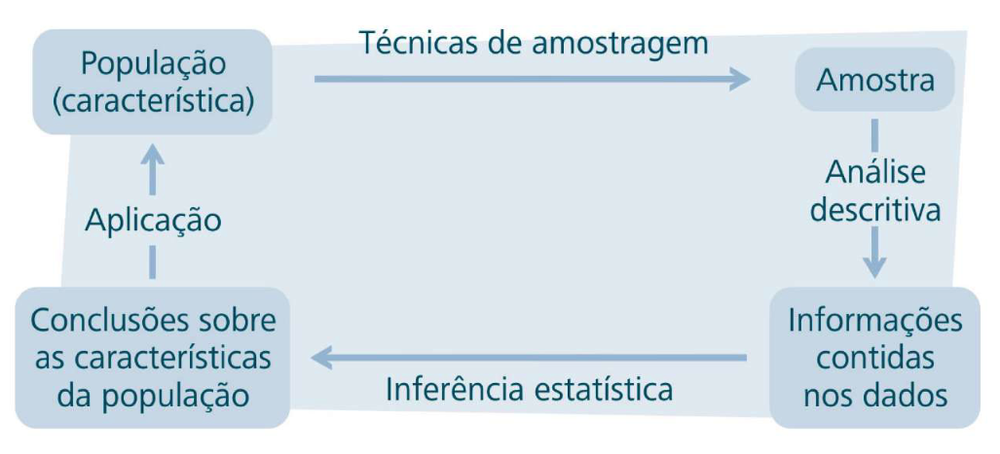

## 3. Tipos de Variáveis

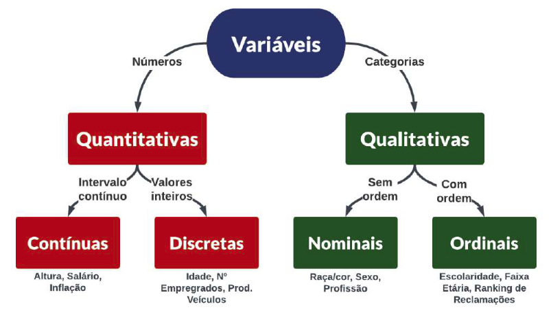

## 4. Teorema do Limite Central

É um dos principais teoremas da estatística que diz que, quando você pega várias amostras aleatórias de uma população e calcula a média de cada uma, independentemente da forma da distribuição original, essas médias se aproximam de uma distribuição normal (formato de sino) à medida que o tamanho das amostras aumenta. O teorema do limite central é importante porque nos permite fazer inferências sobre a população com base em uma amostra. Por exemplo, se você sabe que a distribuição da média amostral é normal, você pode usar uma tabela de distribuição normal para calcular a probabilidade de que a média amostral seja maior ou menor que um determinado valor.

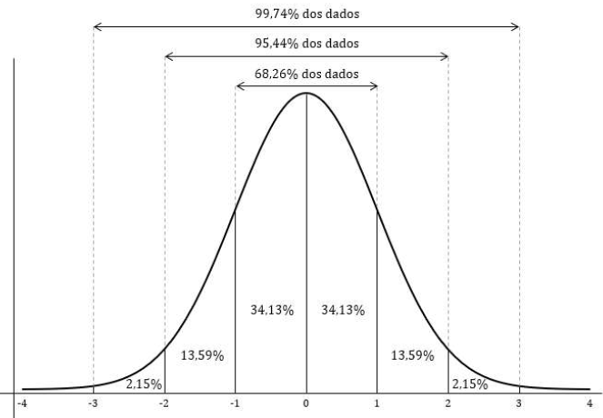

## 5. Tipos de Medidas

### 5.1. Medidas de Posição

- **MÉDIA**: É a soma de todos os valores dividida pelo número de valores. É a medida mais comum de tendência central. No entanto, ela pode ser sensível a valores extremos.

- **MEDIANA**: É o valor que divide o conjunto de dados em duas partes iguais. Em outras palavras, é o valor do meio quando os dados estão ordenados. A mediana não é influenciada por valores extremos e é útil em distribuições assimétricas.

- **MODA**: É o valor que ocorre com mais frequência em um conjunto de dados. Pode haver uma ou mais modas, ou o conjunto pode não ter uma moda. A moda é útil em dados categóricos ou quando se deseja identificar os valores mais frequentes.

**EXEMPLO DE CÁLCULO DE MÉDIA, MEDIANA E MODA**:

**Conjunto de Dados**: {15, 18, 25, 25, 40, 55, 58, 60, 80}  
**Média**: 41,77 (Soma de todos os valores dividido pelo número de valores)
**Mediana**: 40 (Ponto central dos dados ordenados)
**Moda**: 25 (Valor mais frequente)

## 5.2. Medidas de Dispersão

- **Variância**: É a média dos quadrados das diferenças entre cada valor e a média aritmética. Ela fornece uma ideia de quão distantes os valores estão da média, considerando o peso de cada diferença ao quadrado.

- **Desvio Padrão**: É a raiz quadrada da variância. Ele expressa a dispersão em termos da mesma unidade dos dados e é uma medida de dispersão mais comum.

- **Coeficiente de Variação**: É o desvio padrão dividido pela média, expresso como porcentagem. Ele indica a variabilidade relativa dos dados em relação à média e é útil para comparar a dispersão entre conjuntos de dados diferentes.

**EXEMPLO DE CÁLCULO DE VARIÂNCIA, DESVIO PADRÃO E COEFICIENTE DE VARIAÇÃO**:

**Conjunto de Dados**: {15, 18, 25, 25, 40, 55, 58, 60, 80}
**Variância**: 509,44 (Média dos quadrados das diferenças entre cada valor e a média aritmética)
**Desvio Padrão**: 22.58 (Raiz quadrada da variância, é expresso na mesma escala dos dados)
**Coeficiente de Variação**: 54,05% (Desvio padrão dividido pela média)

## 5.3. Medidas de Forma

- **Assimetria**: Indica o grau e a direção da distorção da distribuição em relação à média. Uma assimetria positiva significa que a cauda direita da distribuição é mais longa (os valores maiores estão mais espalhados), enquanto uma assimetria negativa significa que a cauda esquerda é mais longa.

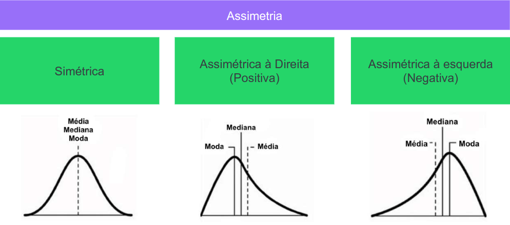

- **Curtose**: Mede o pico ou a "pontuação" da distribuição. Uma curtose alta indica uma distribuição mais concentrada (pico mais agudo e caudas mais pesadas), enquanto uma curtose baixa indica uma distribuição mais achatada (pico menos agudo e caudas menos pesadas).

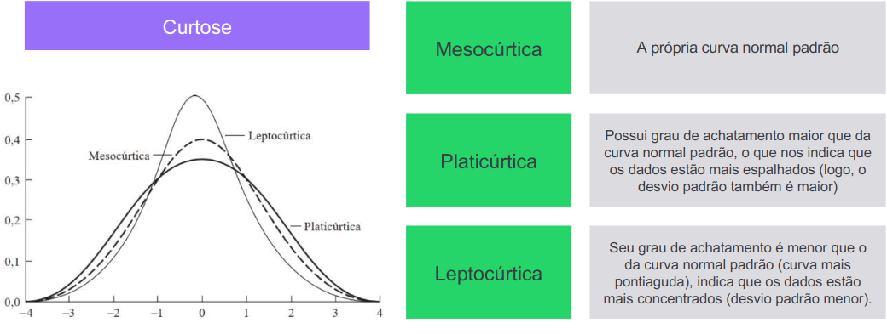

**EXEMPLO DE CÁLCULO DE ASSIMETRIA E CURTOSE**:

**Conjunto de Dados**: {15, 18, 25, 25, 40, 55, 58, 60, 80}  
**Assimetria**: 0,3036 (Positiva = Moda < Mediana < Média)
**Curtose**: -1,19 (Platicúrtica)

## 6. Correlação

A correlação na estatística mede a relação entre duas variáveis, indicando se elas têm uma associação linear positiva (aumentam juntas), negativa (uma aumenta enquanto a outra diminui) ou nenhuma correlação. A importância para algoritmos de Machine Learning reside na capacidade de identificar padrões e relações entre variáveis. A correlação ajuda a selecionar características relevantes para os modelos, melhorando a precisão e interpretabilidade. Também permite ajustar modelos para prever com maior acurácia com base nas relações observadas nos dados.

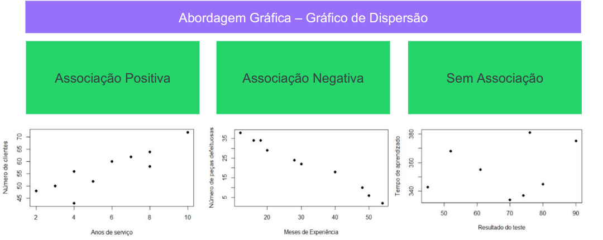

- **Coeficiente de Pearson**: Mede a relação linear entre duas variáveis, variando de -1 (correlação negativa perfeita) a 1 (correlação positiva perfeita), e 0 para nenhuma correlação. Adequado para variáveis numéricas que possam ter uma relação linear.

- **Coeficiente de Spearman**: Avalia a relação monotônica (não necessariamente linear) entre variáveis, usando uma escala similar ao Pearson. É útil quando os dados não têm uma relação linear clara ou quando as variáveis não são numericamente escalonáveis.

*Use o coeficiente de correlação de Pearson quando você espera uma relação linear entre variáveis numéricas. Use o coeficiente de correlação de Spearmanquando não houver uma relação linear clara, ou se as variáveis forem ordinais ou não-numéricas, capturando possíveis associações monotônicas.*

**EXEMPLO DE CÁLCULO DE CORRELAÇÃO**:

**Conjunto de Dados**:
**Tempo de Serviço (Meses)**: {6, 10, 12, 18, 24, 30, 36, 50}
**Salário**: {1800, 2000, 2400, 3000, 3600, 4300, 5100, 6000}

**Correlação de Pearson**: 0,9944
**Correlação de Spearman**: 1.00
**Coeficiente de Variação Tempo de Serviço**: 64,03%
**Coeficiente de Variação Salário**: 42,96%

## Representações Gráficas

- **Histograma**: Mostra a distribuição de uma variável numérica. Ele divide os valores em intervalos e mostra a frequência de valores em cada intervalo. É usado para variáveis numéricas contínuas, mostrando a distribuição dos dados em intervalos.

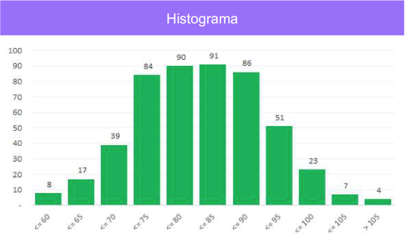

- **Gráfico de Barras**: Mostra a distribuição de uma variável categórica. Ele mostra a frequência de cada categoria em um gráfico de barras. Aplicável a variáveis categóricas ou discretas, exibindo a contagem ou frequência de cada categoria.

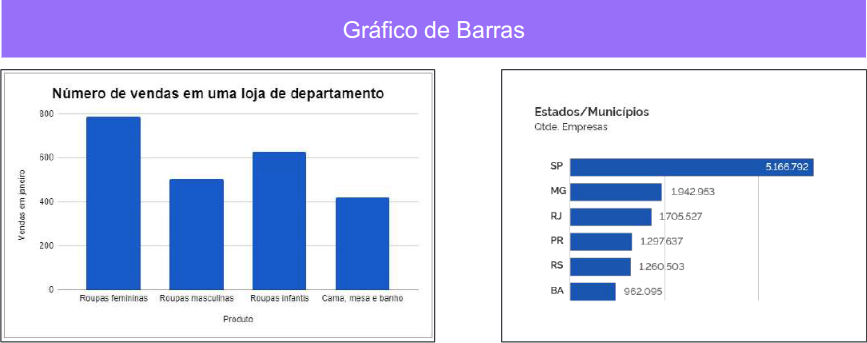

- **Gráfico de Dispersão**: Mostra a relação entre duas variáveis numéricas. Ele exibe pontos no gráfico, onde cada ponto representa um par de valores. Usado para mostrar a relação entre duas variáveis numéricas, ajudando a identificar padrões ou tendências.

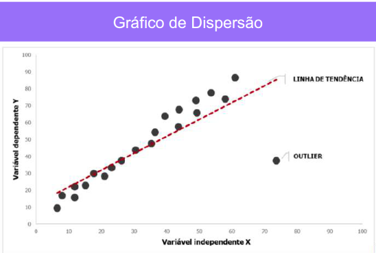

- **Box Plot (Diagrama de Caixa)**: Mostra a distribuição de uma variável numérica, exibindo a mediana, quartis, valores mínimos e máximos, e possíveis outliers. Adequado para variáveis numéricas ou categóricas ordinais, revelando distribuição, mediana e valores atípicos.

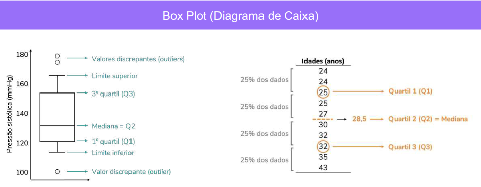

- **Gráfico de Linhas**: Mostra a relação entre duas variáveis numéricas em um gráfico de linhas. Utilizado para variáveis numéricas ao longo do tempo ou em uma sequência, destacando tendências temporais.

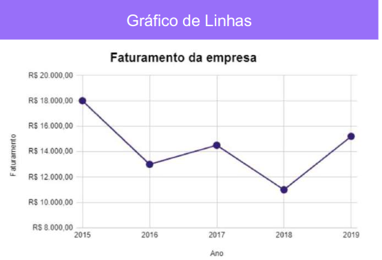
